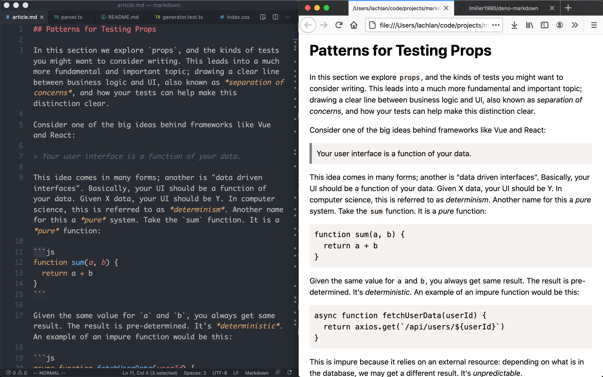

This is my first ever compiler. It compilers markdown to HTML. It probably has a lot of bugs and is missing a ton of features. I learned a lot writing it and will improve it in the future.

The architecture is fairly simple:

1. Tokenize
2. Parse (get AST)
3. Code Gen

Supports:

- links with `[blah blah](https://blah.com)`
- italic text with `*blah*`
- blockquote with `> Blockquote`
- h1 tags with `# Blah` (will add levles 2-6 eventually)
- inline code and code blocks
- `test-data` contains a markdown file that cn be convereted to HTML by running `deno run --allow-read main.ts test-data/article.md > test-data/article.html`. 

It looks like this with some basic styling:

